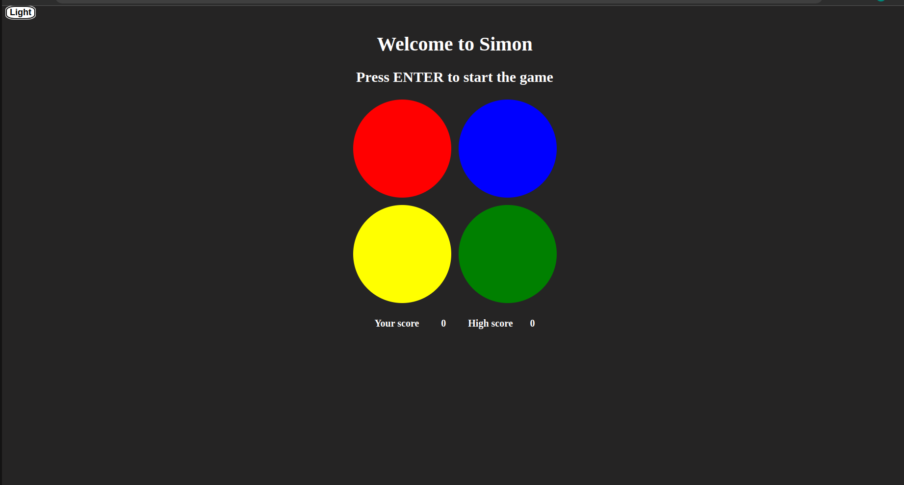
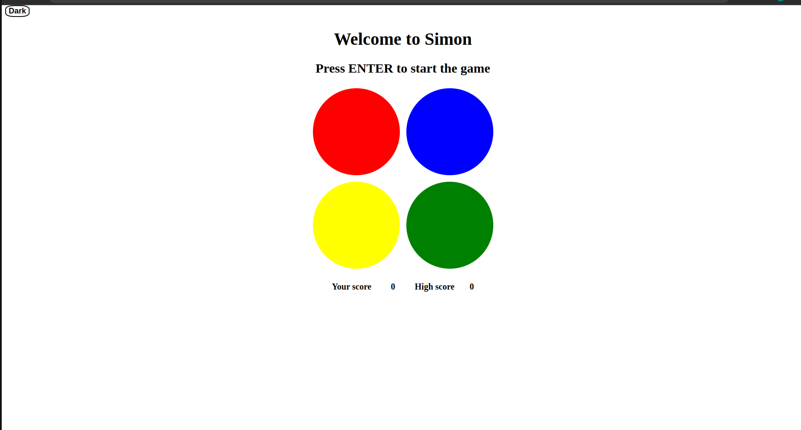

# Simon - A browser based game

* Simon is a simple game of short-term memory skill. How long a sequence can you remember?
* It's my first project as a Web Developer.

# Sceenshots:

There are two modes you can choose from.

# Technologies Used:

* HTML/CSS
* JavaScript

# Getting Started:

* The challenge is to repeat ever-increasing sequence. If you fail to complete the sequence in the     correct order, the buzzzer will sound and game will end, showing you your score and whether it was the high score or not. There is a counter to keep track of your progress.

* After the game has ended, player can push the restart button to keep playing.

* To challenge myself, I added support for keyboard, which is not a part of original game. The game can also be played by using keys "q", "w", "a" and "s". 

* Game also has a button which can be pressed to toggle between Ligth and Dark mode.

[Play the game](https://vivekrana0.github.io/simon-game/)

# Next Steps:

* A button to turn the sound OFF or ON.

* Make UI better.

* Add sound only mode to increase difficulty.

